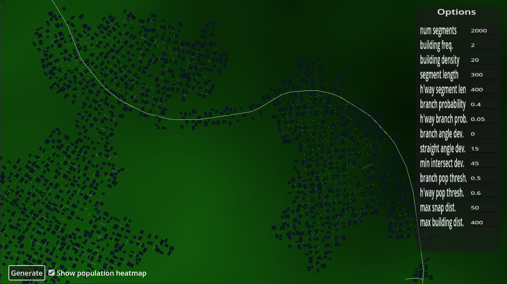

# citygen-godot

Source code for the interactive procedural city generation algorithm described [here](http://tmwhere.com/city_generation.html), ported to Godot 4.2 using GDScript.

Exported to HTML5 at https://t-mw.github.io/citygen-godot/.

## Controls

- Drag to pan
- Scroll to zoom

## Structure

- `Main` node coordinates the other classes and does some simple drawing.
- `CityGen` node contains the city generation algorithm. The size of the city can be customized using the `segment_count_limit` in the inspector for the node.
- `PopulationHeatmap` node generates the population heatmap that influences the density of the generated city. The noise used for the heatmap can be customized in the inspector for the node.

`city_gen.gd` should be easily copied out for use in other projects, since its only dependencies are the `PopulationHeatmap` node and auto-loaded (global) city-gen options defined in `options.gd`.
